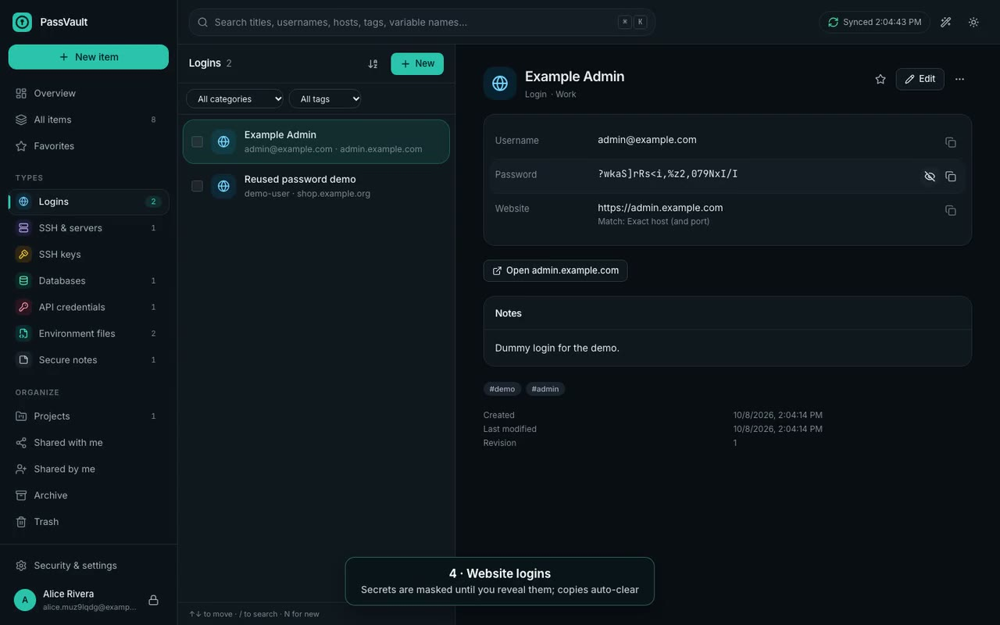

# PassVault

End-to-end-encrypted password and developer-secrets manager for individuals
and small teams: website logins, SSH servers and keys, database credentials,
API tokens, `.env` files, and secure notes — with a web dashboard, a Manifest V3
browser extension, and a macOS desktop app (Neutralinojs) that has an embedded
SSH terminal and an SSH agent.

[](docs/media/passvault-walkthrough.mp4)

*Two-minute end-to-end walkthrough, generated with Playwright + ffmpeg ([how](docs/E2E_VIDEO.md)).*

> **Status:** working software, not yet independently audited. Read
> [docs/SECURITY_REVIEW.md](docs/SECURITY_REVIEW.md) before storing real
> production secrets. Implementation status: [docs/STATUS.md](docs/STATUS.md).

## Quick start (development)

Requirements: Node 22, pnpm 10, Go 1.25 (desktop helper), Podman (or a local
PostgreSQL 14+), macOS for the desktop app.

```bash
pnpm install
```

```bash
cp .env.example .env    # then set POSTGRES_PASSWORD and the API secrets
```

```bash
podman compose up -d    # postgres + mailpit + api
```

Or without containers:

```bash
bash scripts/dev-postgres.sh start   # local cluster on 127.0.0.1:54329
```

```bash
pnpm --filter @passvault/api prisma:deploy && pnpm dev:api
```

```bash
pnpm dev:web    # http://localhost:5173
```

Production: [docs/DEPLOYMENT.md](docs/DEPLOYMENT.md). Browser extension: [docs/EXTENSION.md](docs/EXTENSION.md). Desktop app:
[docs/DESKTOP.md](docs/DESKTOP.md). Operations, configuration, backups:
[docs/OPERATIONS.md](docs/OPERATIONS.md).

## Tests

```bash
pnpm test
```

```bash
cd native/desktop-helper && make test
```

## Documentation

| Topic | Document |
|---|---|
| Architecture & capability matrix | [docs/ARCHITECTURE.md](docs/ARCHITECTURE.md) |
| Threat model | [docs/THREAT_MODEL.md](docs/THREAT_MODEL.md) |
| Encryption & key management | [docs/CRYPTO.md](docs/CRYPTO.md) |
| Data model & server-visible metadata | [docs/DATA_MODEL.md](docs/DATA_MODEL.md) |
| API contracts | [docs/API.md](docs/API.md) |
| Sync & offline | [docs/SYNC.md](docs/SYNC.md) |
| `.env` syntax & editing | [docs/ENV_FILES.md](docs/ENV_FILES.md) |
| User journeys | [docs/USER_JOURNEYS.md](docs/USER_JOURNEYS.md) |
| Browser extension | [docs/EXTENSION.md](docs/EXTENSION.md) |
| Desktop app, packaging, signing | [docs/DESKTOP.md](docs/DESKTOP.md) |
| Desktop helper & IPC | [docs/DESKTOP_HELPER.md](docs/DESKTOP_HELPER.md), [docs/DESKTOP_IPC.md](docs/DESKTOP_IPC.md) |
| **Production deployment** | [docs/DEPLOYMENT.md](docs/DEPLOYMENT.md) |
| Operations, backup/restore, recovery | [docs/OPERATIONS.md](docs/OPERATIONS.md) |
| Dependencies & licenses | [docs/DEPENDENCIES.md](docs/DEPENDENCIES.md) |
| Status, test results, limitations | [docs/STATUS.md](docs/STATUS.md) |
| End-to-end walkthrough video | [docs/E2E_VIDEO.md](docs/E2E_VIDEO.md) |
| Pre-production security review | [docs/SECURITY_REVIEW.md](docs/SECURITY_REVIEW.md) |
