# PassVault architecture

PassVault is an end-to-end-encrypted password and developer-secrets manager
for individuals and small teams. It stores website logins, SSH servers and
keys, database credentials, API tokens, `.env` files, and secure notes, and is
used from three clients — a web dashboard, a Manifest V3 browser extension,
and a macOS desktop app — backed by a NestJS/PostgreSQL API that only ever sees
ciphertext and authorization metadata.

This document explains how the system is put together and why. Companion
documents go deeper on specific areas:

| Topic | Document |
|---|---|
| Cryptography and key management | [CRYPTO.md](CRYPTO.md) |
| Threats, trust boundaries, mitigations | [THREAT_MODEL.md](THREAT_MODEL.md) |
| HTTP API contracts | [API.md](API.md) |
| Data model and server-visible metadata | [DATA_MODEL.md](DATA_MODEL.md) |
| Sync and offline behaviour | [SYNC.md](SYNC.md) |
| `.env` parsing and editing | [ENV_FILES.md](ENV_FILES.md) |
| Browser extension | [EXTENSION.md](EXTENSION.md) |
| Desktop app; native helper; IPC | [DESKTOP.md](DESKTOP.md), [DESKTOP_HELPER.md](DESKTOP_HELPER.md), [DESKTOP_IPC.md](DESKTOP_IPC.md) |
| Deployment and operations | [DEPLOYMENT.md](DEPLOYMENT.md), [OPERATIONS.md](OPERATIONS.md) |

---

## 1. Design principles

1. **Zero-knowledge server.** Everything sensitive — titles, usernames, URLs,
   hosts, notes, tags, project names, `.env` contents — is encrypted on the
   client before it leaves the device. The server enforces *authorization* on
   identifiers and memberships; it never needs to read content.
2. **Separate account access from vault access.** Logging in (password-derived
   `authKey` + mandatory TOTP) proves who you are; unlocking (decrypting the
   User Key) happens locally and works offline. Resetting account access can
   never silently bypass vault encryption.
3. **One client core, three shells.** `packages/vault-core` (session, crypto
   orchestration, sync, search, insights) and `packages/app` (React UI) are
   shared; each client contributes only a small platform adapter.
4. **Native power behind a narrow door.** SSH, PTY sessions, the SSH agent,
   Keychain and Touch ID live in a small Go helper that exposes a typed,
   validated, allow-listed operation set — never a generic shell.
5. **Never overwrite silently.** Optimistic concurrency, idempotent mutations,
   conflict UI, tombstones, encrypted version history.
6. **Honest limits.** Encryption cannot protect an unlocked compromised device,
   a malicious client update, or secrets a collaborator already copied; the UI
   and docs say so where it matters.

---

## 2. System context

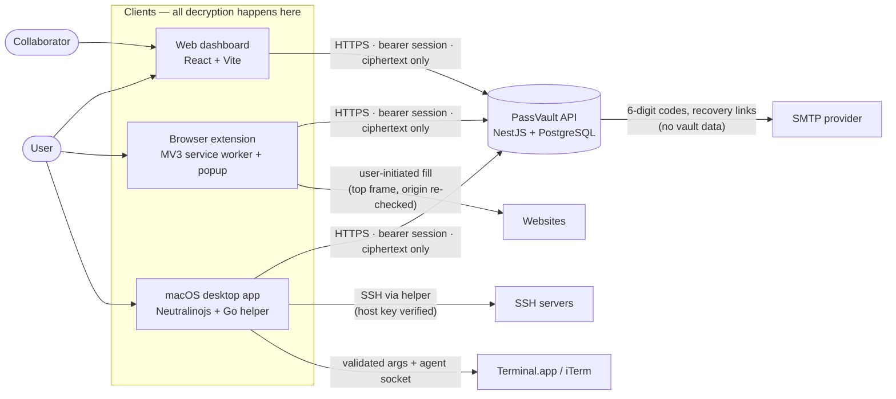

---

## 3. Containers and components

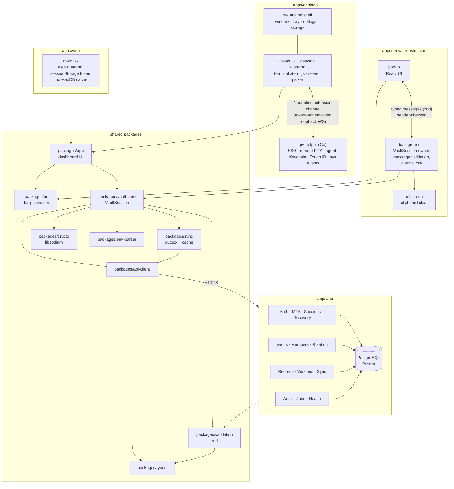

### Package dependency graph

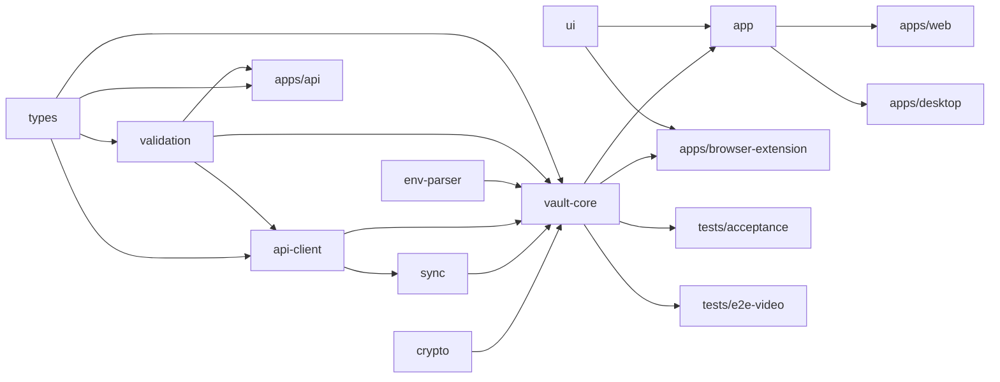

`types` and `validation` are published to the API as CommonJS builds
(`dist/cjs`) and consumed by every client as TypeScript source (ESM), via
conditional `exports`.

---

## 4. Responsibilities by layer

| Layer | Owns | Never does |
|---|---|---|
| **crypto** | Argon2id KDF, subkeys, AEAD envelopes, sealed-box grants, Ed25519 signatures, recovery keys, generators | network, storage, UI |
| **vault-core** | `VaultSession`: register/login/MFA/unlock/lock, decrypt/encrypt records, sharing & rotation, versions, conflicts, local search & insights, URL matching | persist plaintext; talk to native APIs directly |
| **sync** | encrypted cache stores (IndexedDB, KV, memory), outbox with mutation ids and base revisions, pull by cursor, tombstones, purge on lost access | decrypt anything |
| **app / ui** | dashboard screens, dialogs, command palette, theming, accessibility | crypto decisions (delegates to vault-core) |
| **platform adapters** | token storage, prefs, cache store, clipboard, file dialogs, biometrics, external links, extension points | business rules |
| **pv-helper** | SSH client + jump hosts + host-key checks, remote PTY, SSH agent with per-use approval, Keychain/Touch ID, system lock/sleep events, external terminal launch, 0600 exports | generic command execution; logging secrets; accepting unknown ops/fields |
| **API** | identity, sessions, MFA, recovery, memberships & roles, record storage with revisions/versions/tombstones, sync cursor, audit, rate limits | decrypting or parsing envelopes |

---

## 5. Key hierarchy

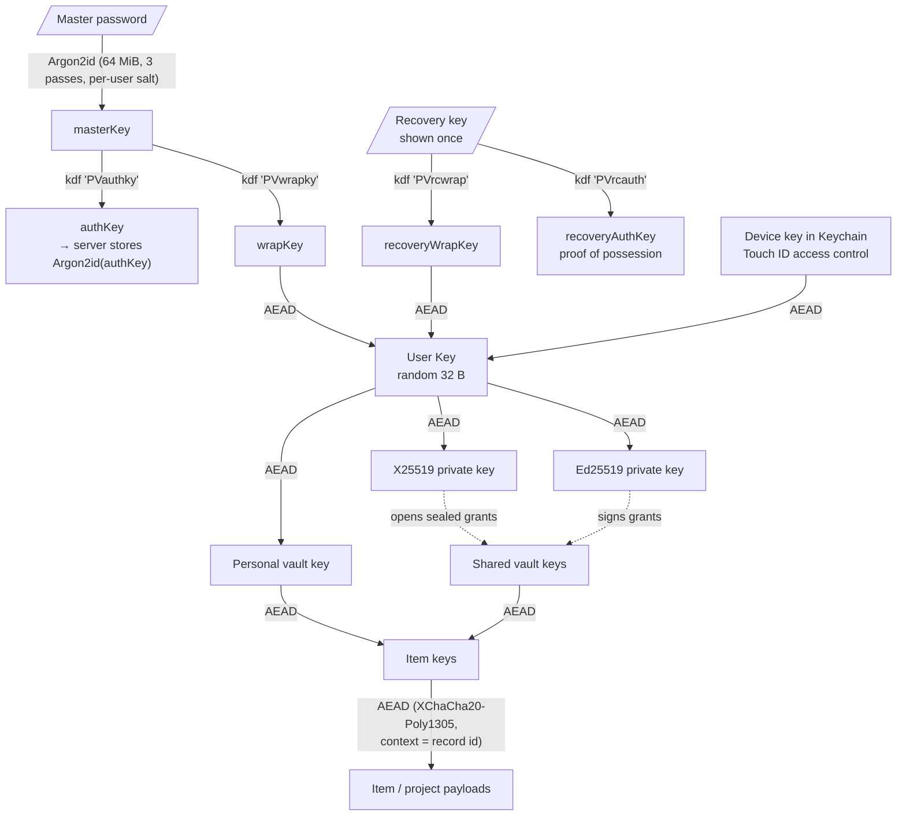

Every symmetric envelope is versioned (`version byte · algorithm byte · nonce ·
ciphertext`) and bound to its usage context through AEAD associated data, so a
malicious server cannot swap ciphertexts between records, vaults, or key
versions. Details: [CRYPTO.md](CRYPTO.md).

---

## 6. Core flows

### 6.1 Registration (email verified first)

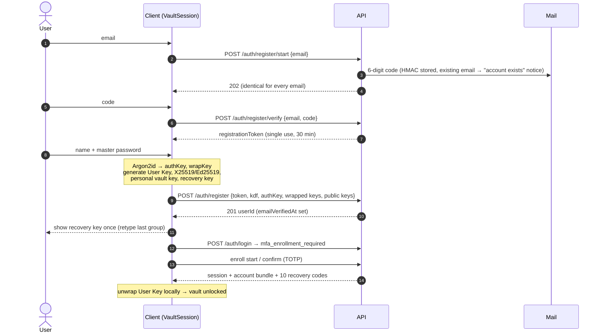

### 6.2 Login, MFA, and unlock

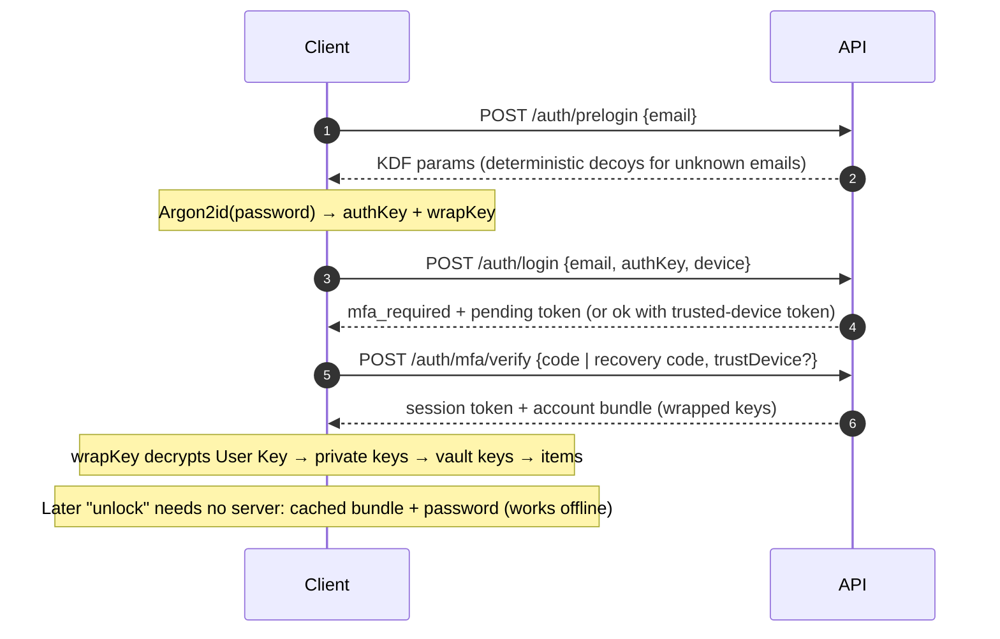

### 6.3 Saving an item and syncing

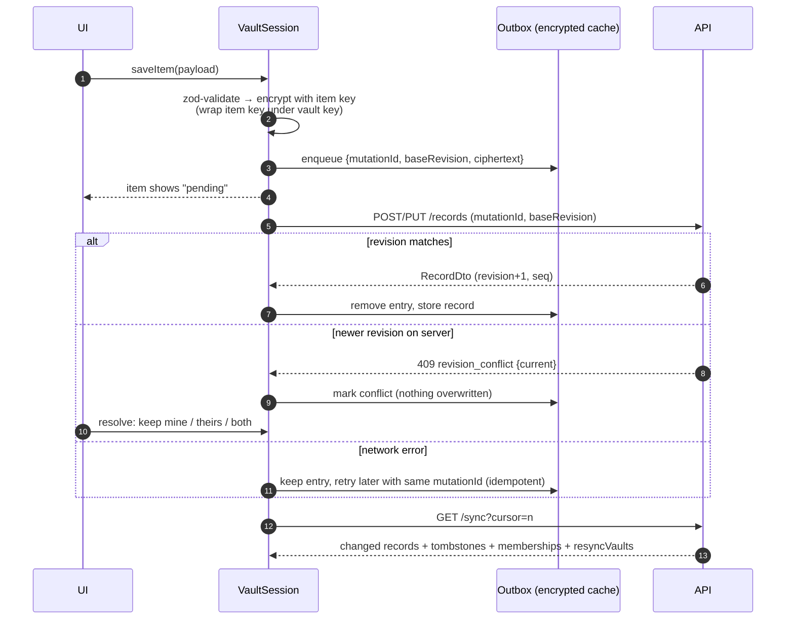

### 6.4 Sharing and revocation

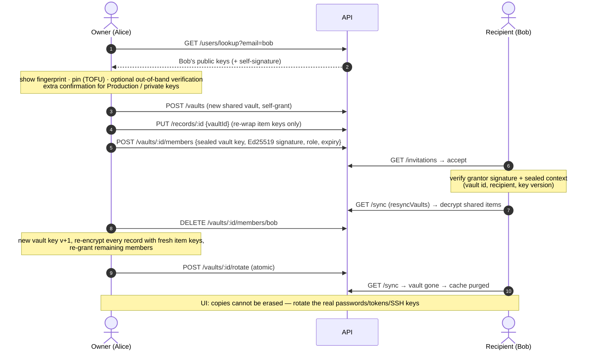

### 6.5 Browser-extension autofill

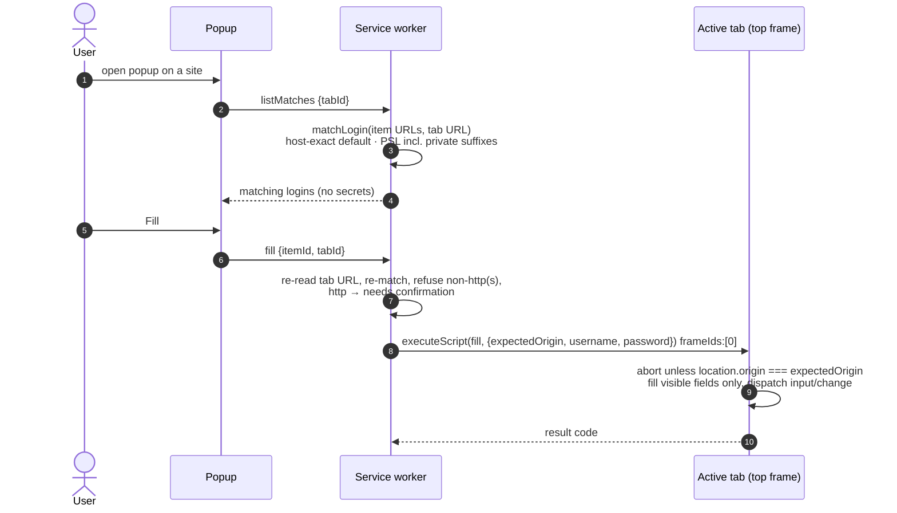

### 6.6 Desktop SSH session with host-key verification

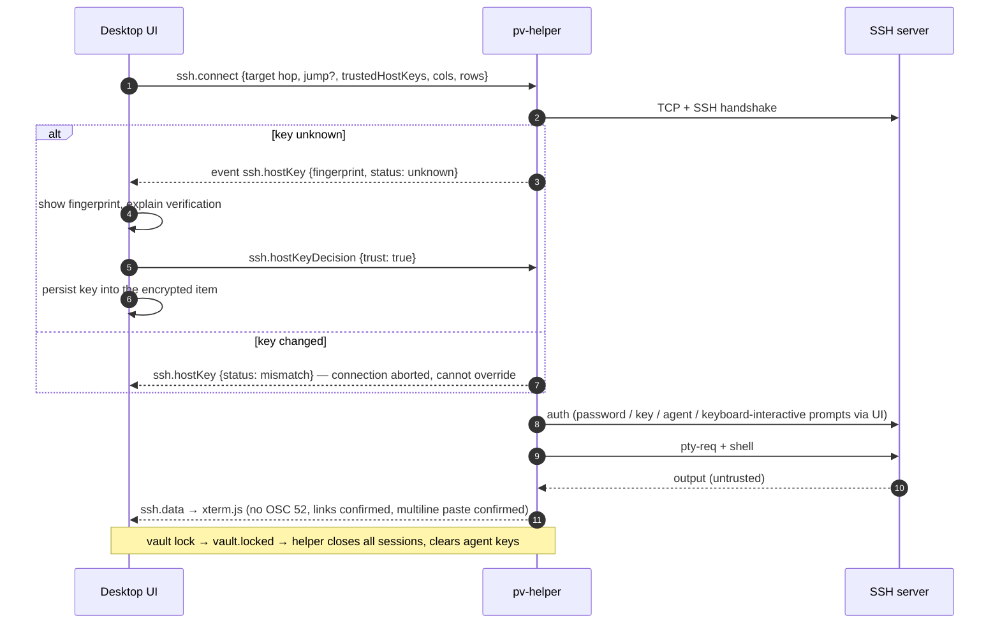

### 6.7 SSH agent signing

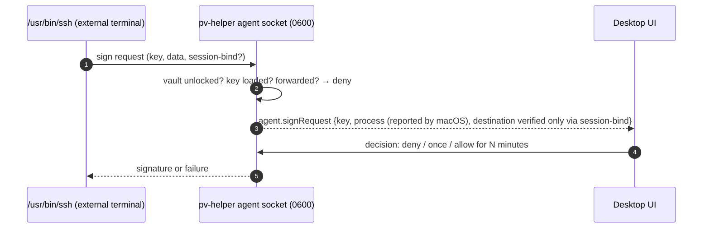

### 6.8 Desktop server switch

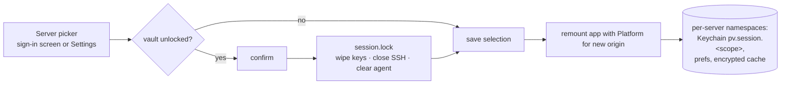

Only two servers are offered — the configured production server and
`http://localhost:3000` — and the desktop CSP `connect-src` lists exactly those.

---

## 7. Data model (server side)

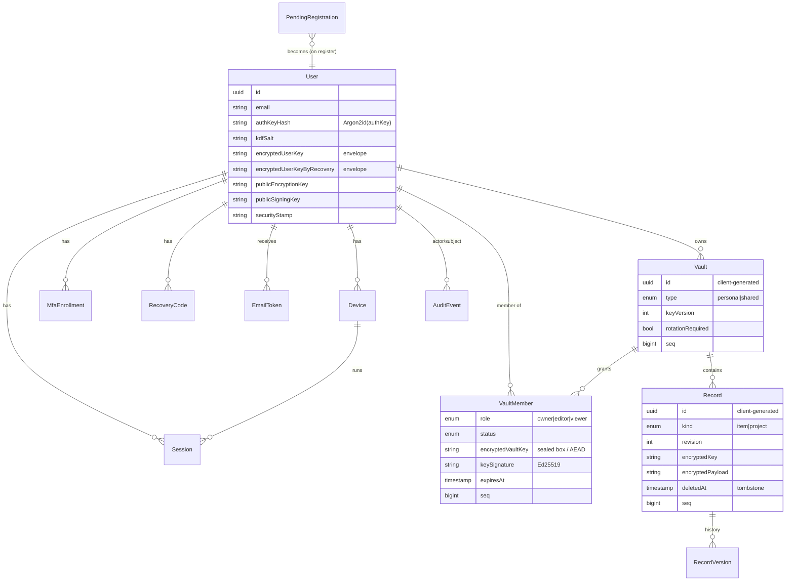

What the server can and cannot observe is listed in
[DATA_MODEL.md](DATA_MODEL.md#server-visible-metadata).

---

## 8. Sync model

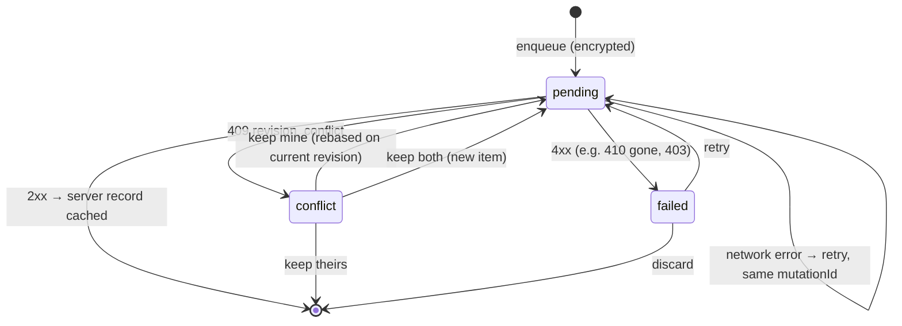

- A single Postgres sequence stamps every change; writes take a transaction-
  scoped advisory lock so sequence order equals commit order and cursors never
  skip late commits.
- Tombstones are permanent, so stale devices never resurrect deleted items.
- Losing access to a vault (revoked/expired) purges its cached records on the
  next sync. Offline devices learn about revocation only when they reconnect.

---

## 9. Trust boundaries

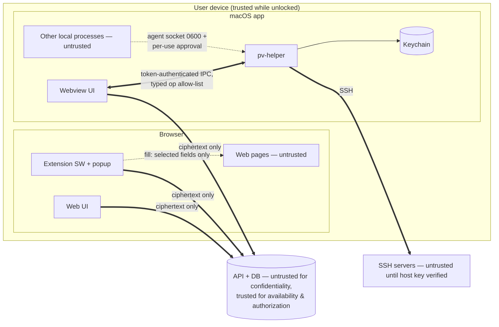

Full analysis (adversaries, threats, mitigations, residual risk):
[THREAT_MODEL.md](THREAT_MODEL.md).

---

## 10. Deployment topology

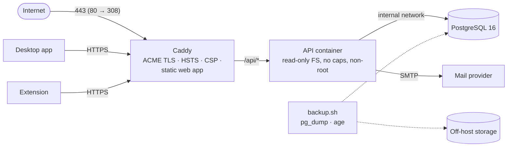

`deploy/compose.prod.yaml` + `deploy/Caddyfile` + `deploy/deploy.sh`; see
[DEPLOYMENT.md](DEPLOYMENT.md). The production URL is supplied at build/deploy
time and is never hard-coded in the repository.

---

## 11. Client capability matrix

| Capability | Web | Extension | Desktop (macOS 14+) |
|---|---|---|---|
| Register (email code first), login + TOTP, recovery codes | ✓ | login/verify, enrollment | ✓ |
| Unlock / lock / inactivity lock | ✓ | ✓ (alarms) | ✓ + screen lock / sleep |
| Biometric unlock | — | — | Touch ID via Keychain access control (signed builds) |
| All item types | ✓ | view + copy, save/update logins | ✓ |
| Local search, insights, generator | ✓ | search, generator | ✓ |
| Autofill | — | user-initiated, top frame | — |
| Save prompt after sign-in | — | opt-in ("Offer to save passwords") | — |
| `.env` structured/raw editing, history, compare | ✓ | — | ✓ |
| Projects, sharing, invitations, revocation + rotation | ✓ | — | ✓ |
| Version history / conflict resolution | ✓ | via dashboard | ✓ |
| Offline unlock of cached vault | ✓ (IndexedDB) | ✓ (IndexedDB) | ✓ (Neutralino storage) |
| SSH keys generate/inspect | import + fingerprint | — | ✓ (Go `x/crypto/ssh`) |
| Embedded SSH terminal, external terminal, SSH agent | — | — | ✓ |
| Server switch (production ↔ local) | — (served by its server) | build-time | ✓ runtime |
| Owner-only (0600) exports | browser download | — | ✓ |

---

## 12. Cross-cutting concerns

| Concern | Approach |
|---|---|
| **Validation** | One set of zod schemas (`packages/validation`) for API requests and decrypted payloads; strict objects reject unknown fields; the helper mirrors host/port/username rules in Go. |
| **Errors** | `{error:{code,message,details},requestId}`; clients map codes (e.g. `revision_conflict`, `invalid_code`, `rate_limited`) to human messages. |
| **Logging** | API: pino with redaction (no bodies, tokens, authKeys, codes, ciphertext; IPs truncated). Helper: op names, ids, error codes only. Clients: no analytics, session replay, or crash-report SDKs. |
| **Rate limiting** | per-IP global and auth limits, per-email limits on registration/recovery, progressive account lockout. |
| **Configuration** | API validates env at startup and refuses weak/missing secrets in production; clients take only public build-time URLs. |
| **Accessibility** | keyboard navigation, focus trapping in dialogs, visible focus rings, ARIA roles for lists/tabs/menus, reduced-motion support, light/dark themes. |
| **Memory hygiene** | lock wipes key buffers (`sodium.memzero`) and drops decrypted state; JS/Go GC limits are documented. |

---

## 13. Testing strategy

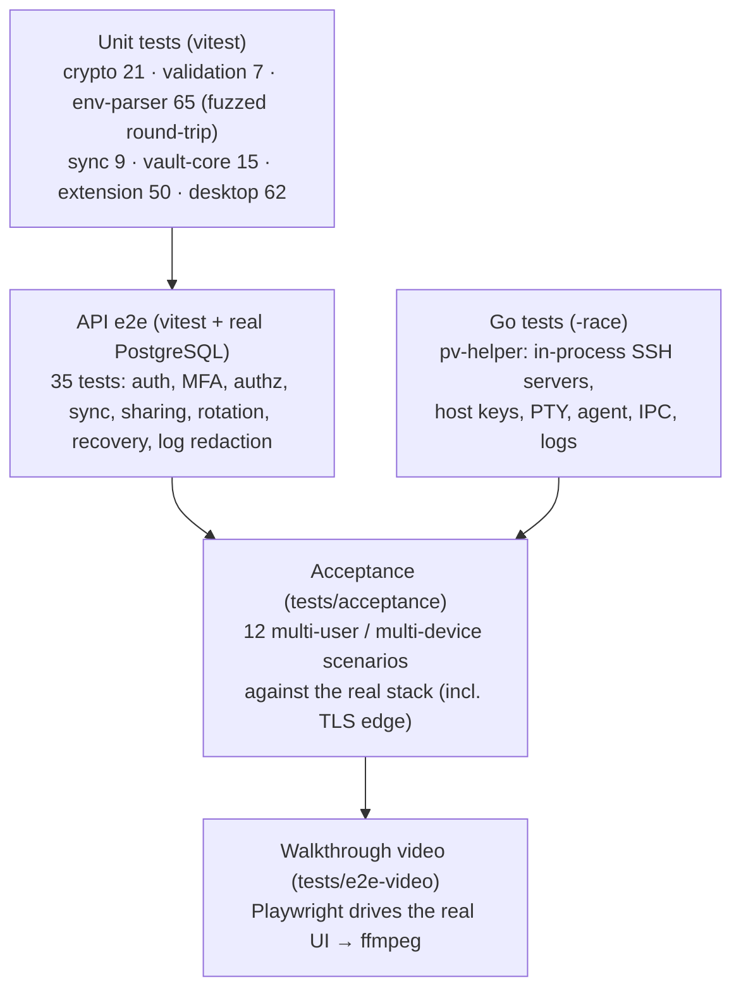

---

## 14. CI/CD

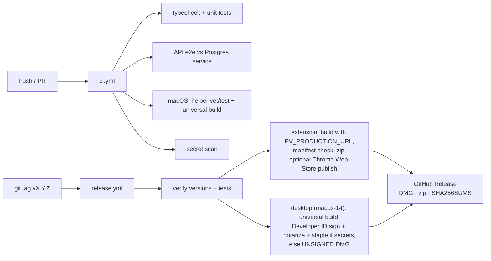

---

## 15. Technology decisions

See [DEPENDENCIES.md](DEPENDENCIES.md) for versions and licenses. Highlights:

- **libsodium (WebAssembly)** everywhere on clients — one reviewed
  implementation for browser, MV3 service worker, Node, and the desktop webview.
- **Client-side Argon2id + derived `authKey`** (server re-hashes) instead of
  sending the password; an aPAKE (OPAQUE) upgrade path is noted in
  [SECURITY_REVIEW.md](SECURITY_REVIEW.md).
- **Opaque, hashed session tokens** rather than JWTs, so revocation is instant.
- **Global change sequence + advisory lock** for correct sync cursors at
  small-team scale.
- **NestJS 11, Prisma 6, TypeScript 5.9** — stable majors chosen deliberately.
- **Go helper** — `golang.org/x/crypto/ssh` is a mature SSH client and agent
  implementation; cgo only for Security, LocalAuthentication and AppKit.
- **Neutralinojs** for a small desktop shell without bundling a browser engine
  or Node runtime.
- **Podman** for local and production containers; Caddy for automatic TLS.
